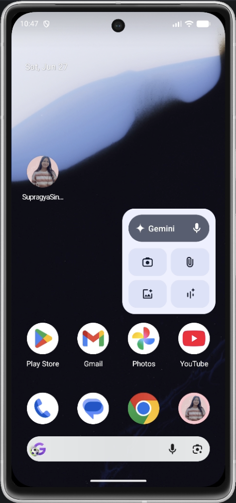
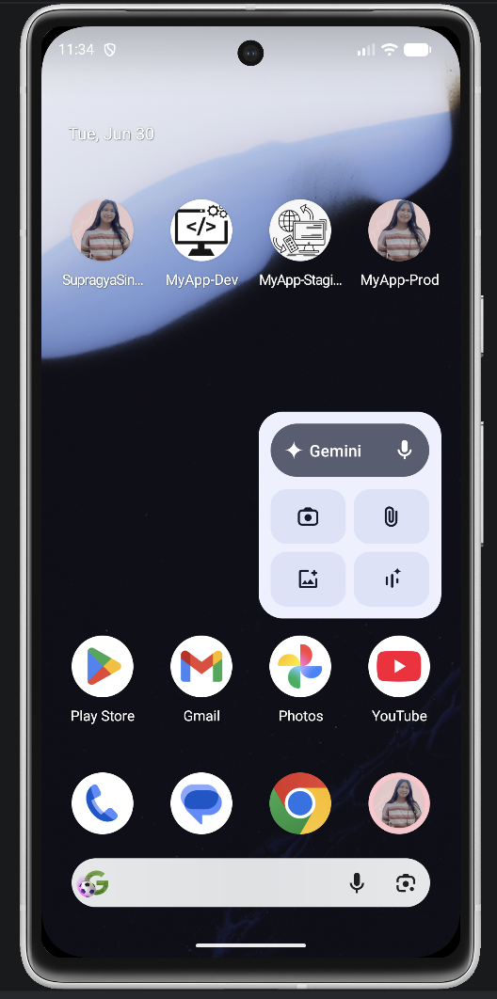

# Supragya Singh Sipai My Profile App
### Assignment 1
A simple Flutter profile application that displays a profile photo and name, featuring a custom app icon and app name for Android and iOS.

### Assignment 2

The Flutter profile application is enhanced with multiple app flavors (Dev, Staging, and Prod) using flutter_flavorizr. Each flavor runs independently with different configurations, launcher icons, and environment labels.

## Features
### Assignment 1
- **Custom app name** for Android and iOS
- **Custom app icon** using a profile photo
- **Profile home screen** with name and image

### Assignment 2
- Added multiple **app flavors (Dev, Staging, Prod)**
- Different **configurations per environment**
- Different **launcher icons and app name per flavor**
- **Independent builds** for each flavor using **flutter_flavorizr**

## App Flavors - SetUp Steps
- The concept of Flutter app flavors and the flutter_flavorizr package was researched using the official Flutter and pub.dev documentation.
- The flutter_flavorizr package was added under the dev_dependencies section in pubspec.yaml.
- The project dependencies were installed by running: flutter pub get
- The flavorizr configuration was added to pubspec.yaml, where the dev, staging, and prod flavors were defined.
- A unique applicationId and app name were assigned to each flavor so that all three applications could be installed and run independently on the same device.
- The flavor configuration was generated by running: flutter pub run flutter_flavorizr
- The launcher icons were updated for each flavor. The dev and staging icons were modified to distinguish them from the prod icon
- The home screen was updated to display the active flavor name, such as MyApp-Dev, MyApp-Staging, or MyApp-Prod with their updated icon.
- Each flavor was executed individually to verify that all three versions worked independently.

## App Flavors - Run Commands
The Development flavor was run using:

flutter run --flavor dev

The Staging flavor was run using:

flutter run --flavor staging

The Production flavor was run using:

flutter run --flavor prod

**After executing the above commands, all three application flavors were installed and verified successfully. Each flavor had its own application name, launcher icon, and flavor-specific configuration.**
## Screenshot

### Assignment 1 - Home Screen

### Assignment 2 - Home Screen

---

## Author

**Supragya Singh Sipai**